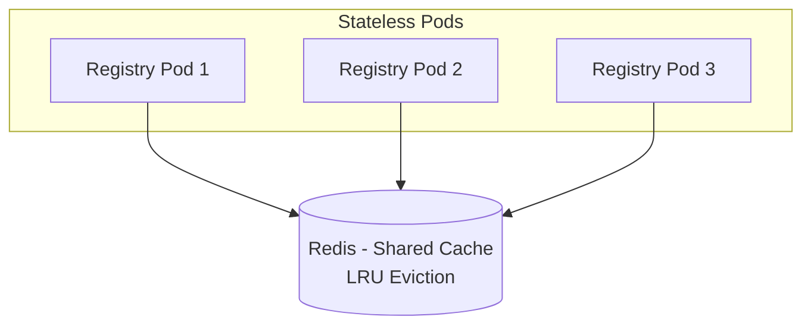
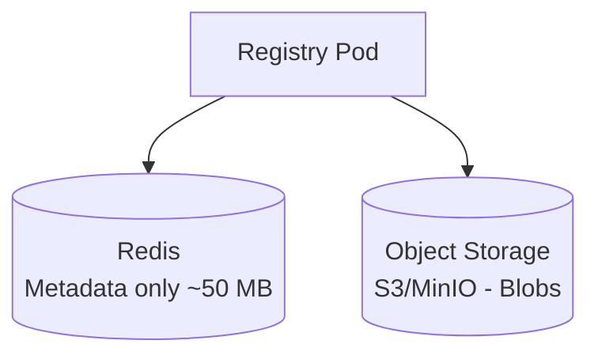
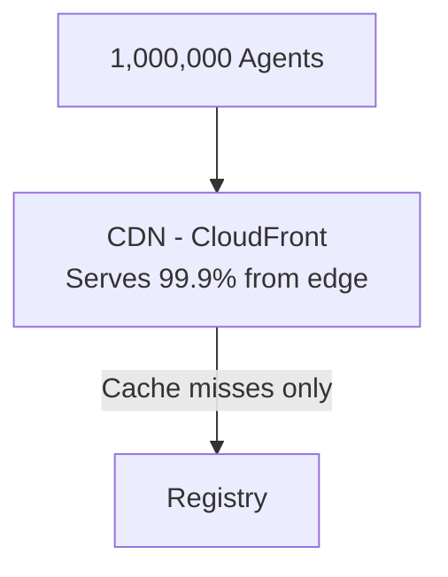

# Kuack Registry Service

The **Kuack Registry Service** is a stateless microservice that acts as an intelligent gateway between the Kuack Node and standard OCI Registries (like Docker Hub, GHCR, or ECR).

Its primary responsibility is to **resolve** and **extract** WebAssembly (WASM) artifacts from standard container images, enabling `kuack-node` to run them without needing to understand OCI layers or image formats itself.

## Why it exists?

In the original design, `kuack-node` handled image pulling and parsing directly. Extracting this logic into a dedicated service offers several advantages:

1.  **Decoupling**: `kuack-node` becomes simpler. It doesn't need to know how to parse tarballs, manifest schemas, or handle OCI authentication nuances. It just asks for a "config" and a "file".
2.  **Stateless Scalability**: The registry service is stateless and can be scaled independently of the nodes.
3.  **Caching**: By sitting between Nodes and OCI registries, this service leverages **Redis** to cache resolved metadata and extracted artifacts. This dramatically speeds up cold starts (resolving an image config takes milliseconds if cached).
4.  **Security**: The Node doesn't need direct internet access to every registry, it only needs to talk to this internal service.

## Architecture

```mermaid
graph LR
    Node[Kuack Node] -->|1. /resolve| Registry[Kuack Registry]
    Agent[Kuack Agent] -->|2. /registry (Ingress)| Registry
    Registry <-->|Cache| Redis[(Redis)]
    Registry <-->|Pull| OCI[(Docker/OCI Registry)]
```

The service is designed to be **stateless**. All persistent state (cached configs and artifacts) is stored in Redis. This allows you to restart or scale the registry service without losing the "hot" cache.

## How it Works

The interaction between `kuack-node` and `kuack-registry` follows a strict **Two-Step Flow**.

### Step 1: Discovery (`/resolve`)

First, the Node asks the Registry to "inspect" an image.
> "I have this image ref `kuack-io/wasi-example:latest`. What is it, and how do I run it?"

The Registry:
1.  Checks Redis cache.
2.  If missing, pulls the image Manifest and Config from the OCI registry.
3.  Scans the layers to find the executable WASM file (e.g., `app.wasm` or `plugin.wasm`).
4.  Determines the execution type (`wasi` or `bindgen`) and architecture.
5.  Returns a **JSON Configuration** object containing the environment variables, entrypoint, and crucially, the **path** to the artifact.

#### Why separate this?

We separate discovery because we don't know *what* file to download yet. A WASM container isn't a standardized single binary, it's a filesystem. We need to find the binary and negotiate the execution environment (env vars, args) before we start streaming bytes.

### Step 2: Fetching (`/registry`)

Once the Node knows the path (e.g., `/app/main.wasm`), it passes this information to the **Agent**. The Agent then requests the file.
> "Give me the file at `/app/main.wasm` from image `kuack-io/wasi-example:latest`."

The Agent sends this request to the **Ingress Controller**, which routes `/registry` traffic directly to the `kuack-registry` service. This bypasses the Node entirely for artifact downloads.

The Registry:
1.  Checks Redis cache for this specific artifact.
2.  If missing, pulls only the specific layer containing that file.
3.  Extracts the file on-the-fly.
4.  Caches the binary in Redis.
5.  Streams the binary to the **Agent**.

## API Reference

### `GET /resolve`
Resolves the configuration for a given WASM image.

**Parameters:**
- `image`: The OCI image reference (e.g., `kuack-io/my-app:v1`).

**Response (200 OK):**
```json
{
  "type": "wasi",
  "path": "/app.wasm",
  "variant": "wasm32/wasi",
  "env": ["KEY=VALUE"],
  "entrypoint": ["/app.wasm"],
  "cmd": ["--help"]
}
```

### `GET /registry`
Downloads a specific artifact from an image.

**Parameters:**
- `image`: The OCI image reference.
- `path`: The absolute path to the file inside the container (returned by `/resolve`).
- `variant`: (Optional) Architecture variant (default: `wasm32/wasi`).

**Response:**
- Returns the binary file stream with `Content-Type: application/wasm` (or octet-stream).

## Configuration

The service is configured via environment variables:

| Variable | Description | Default |
|----------|-------------|---------|
| `PORT` | HTTP Server Port | `8080` |
| `REDIS_ADDR` | Redis address | `localhost:6379` |
| `REDIS_PASSWORD` | Redis password | *(empty)* |
| `REDIS_DB` | Redis DB index | `0` |
| `KLOG_VERBOSITY` | Log level (0-10) | `2` |

## Caching Strategy & Design Rationale

### Why Redis for WASM Blob Storage?

Kuack is designed for environments with:
- **Millions of concurrent agents** (browsers running WASM)
- **Limited WASM image catalog** (tens to hundreds of unique images)
- **Dynamic infrastructure** (pods may restart frequently)

Given these constraints, we deliberately store both **metadata and WASM blobs** in Redis.

#### Design Decision: Delegate Memory to Redis



**Why not per-pod in-memory caching?**
- Pods restart frequently in Kubernetes (rolling updates, scaling, OOM kills)
- Each restart would require re-downloading all WASM images
- With frequent restarts, cold-start latency accumulates

**Why not external object storage (S3)?**
- Adds operational complexity
- For limited image catalogs, Redis is simpler and faster
- Redis provides sub-millisecond reads vs. 10-100ms for S3

### Memory Requirements

| Images | Avg Size | Redis Memory | Recommendation |
|--------|----------|--------------|----------------|
| 50     | 30 MB    | ~1.5 GB      | ✅ Small Redis instance |
| 100    | 50 MB    | ~5 GB        | ✅ Standard Redis |
| 500    | 50 MB    | ~25 GB       | ⚠️ Consider alternatives |
| 1000+  | 50 MB    | ~50+ GB      | ❌ Use object storage |

**IMPORTANT!**

If your WASM image catalog grows beyond 100 large images (~5 GB), you may experience Redis memory pressure. See [Scaling Considerations](#scaling-considerations) below.

### LRU Eviction Policy

Redis can be configured with `allkeys-lru` eviction policy. When Redis reaches its memory limit (`maxmemory`), it automatically evicts **least recently used** keys to make room for new entries.

**Behavior:**
1. Popular images stay cached (frequently accessed = high LRU score)
2. Rarely-used images get evicted first
3. Evicted images are re-fetched from the OCI registry on next request

**Helm configuration:**
```yaml
redis:
  master:
    extraFlags:
      - "--maxmemory 2gb"
      - "--maxmemory-policy allkeys-lru"
```

### Performance Characteristics

| Scenario | Latency | Notes |
|----------|---------|-------|
| Redis cache hit | ~1-5 ms | Fastest path |
| Registry download + cache | 2-10 s | First request for new image |
| LRU eviction + re-fetch | 2-10 s | Cold cache after eviction |

### Scaling Considerations

If Redis memory becomes a bottleneck, consider these alternatives:

#### Option 1: Increase Redis Memory
The simplest solution. Modern cloud providers offer Redis instances up to 100+ GB.

```yaml
redis:
  master:
    extraFlags:
      - "--maxmemory 8gb"
```

#### Option 2: Shared Persistent Volume (ReadWriteMany)
Use a shared filesystem across all registry pods:

```yaml
# Requires CSI driver with RWX support (NFS, EFS, Azure Files)
persistence:
  enabled: true
  accessMode: ReadWriteMany
  size: 50Gi
```

**Pros:** Cheaper than RAM, survives pod restarts
**Cons:** Slower reads (~10-50ms), requires RWX-capable storage

#### Option 3: Object Storage (S3/GCS/MinIO)
For very large catalogs (500+ images):



**Pros:** Unlimited storage, cost-effective
**Cons:** Higher latency, more complexity

#### Option 4: CDN for High Traffic
For millions of concurrent agents:



**Recommended for:** Production with millions of concurrent agents

### When to Reconsider This Design

**Redesign if:**
- Redis OOM kills occur frequently
- WASM catalog exceeds 200+ large images
- Memory costs become prohibitive (>$100/month for Redis alone)

**Current design is optimal when:**
- Image catalog is limited (10-100 images)
- Average image size is under 50 MB
- Fast cold-start is critical
- Operational simplicity is valued
